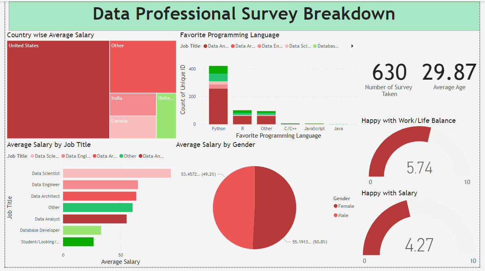

# Data Jobs Survey Analysis

This project aims to analyze survey data on various data job roles, focusing on aspects such as job titles, career switches, salaries, job satisfaction etc.
 
## Dashboard

 ## Dataset Overview:
 The survey data includes the following key questions:

- Q1: Which title best fits your current role?
- Q2: Did you switch careers into data?
- Q3: Current yearly salary (in USD)
- Q4: What industry do you work in?
- Q5: Favorite programming language
- Q6: Job satisfaction in terms of salary, work/life balance, coworkers, management, upward mobility, and learning new things
- Q7: Difficulty of breaking into data
- Q8: Most important factor when looking for a new job
- Q9: Gender
- Q10: Current age
- Q11: Country of residence
- Q12: Highest level of education
- Q13: Ethnicity

## Key Visualizations:
- Most used programming languages by people in data job roles
- Average Salary categorized by different job titles, countries, and gender
- Metrics showcasing average rating of people with happy work/life balance

## Insights:
- Total surveys taken = 630
- Average age of people taking survey = 30
- Highest Average Salary = Data Scientist
- Favourite Programming Language = Python

